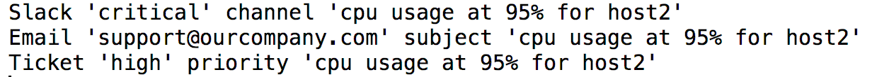

# Project Description
Project  - Events Handling System

A. general information:
1. Create the project using Maven and develop the software with IntelliJ.

2. Use Google's protocol buffer to transfer messages from client to server using socket.

3. Use simple json library to parse the data.

4. The route could not only handle not only one redirect, but also extended to support multiple redirect.

5. For events redirect, make handling different method(get/post/put) multi-threaded.

B. Details about some implementation:
1. For client, it gives the user some guide to input curl command; if necessary, the user could 
configure the condition/actions at run time

2. The different api for different services is separated and api calls could be easily achieved.

C. Questions:
1. What are your design consideration?  
Ans: Before I implement this structure, the first thing that I think most inportant is that the data has
to be correctly transferred to server and that why I use socket; Also I realize since there could be many 
other information be transferred to server, I could use Google Protocol buffer to make it easier; besides,
it takes me some time to think about how to make the client side for the user to use so I let the user firstly
enter the host information and then allow the user to continuously enter the condition/actions until he/she
is done. 

2. Why did you choose to specify the configuration in the way you did? What else did you consider?  
Ans: The most important things for the system are(in my opinion): reliability and user-friendly. That is the 
whole system based on. Because I want to make it easier to use, I use some guidance for the user; because I 
want to make the system reliable, I use some other library to do some jobs for me
 (protocol buffer-transfer/jsonlibrary-parsing). I also have a separate EventsRoute class because I think that
 if there are some other redirects and I can easily extend it.
 
3. Where do you see performance/scalability bottleneck? is any? Do you have any thoughts of
how could we address it?  
Ans: The bottleneck for performance could be that what if there are many clients who want to 
push some <condition + actions> and the server could be busy scanning the machineMap and it could
potentially influence the performance of the system if there are also many 'write' operation
to that map. My thought to solve this is that: we could build a queue to store the recent <condition + actions>
and process it every 2 min(for example). In this way, the 'write' operation will not be blocked.

D. How to run the system? 
1.Clone the project from: https://github.com/peterpandayang/EventHandlingSystem  
2.Open with Intellij and make it to be maven project and build  
3.Run the server; 
4.Run the client. 
5.Enter your curl command as instructed in the terminal and hit enter;
If you want to enter some <condition + actions>, first enter Yes and 
hit enter, then enter the command as instructed and hit enter; you 
can keep doing this so on and so forth; the system will send your 
command to the server once you enter No and hit enter. If you want to
kill the client, simply enter EOF and hit enter. 

Run the project from terminal:
1.Firstly clone the project from: https://github.com/peterpandayang/EventHandlingSystem  
2.Enter the root and use maven to build the project: (/usr/local/Cellar/maven/3.5.2/bin/mvn clean compile package)
3.Open one terminal and start the client: (java -cp ./target/sift-1.0-SNAPSHOT.jar:target/classes/json-simple-1.1.1.jar:target/classes/protobuf-java-3.4.0.jar edu.usfca.cs.sift.client.Client
)
4.Open another terminal and start the server: (java -cp ./target/sift-1.0-SNAPSHOT.jar:target/classes/json-simple-1.1.1.jar:target/classes/protobuf-java-3.4.0.jar edu.usfca.cs.sift.server.Server
) 
5.Play with the system!

The following are the screenshot of the demo:
json input from client:   
  
user input :  
  
server output:  
  

# Happy Playing With the System and Hope You Like It!

